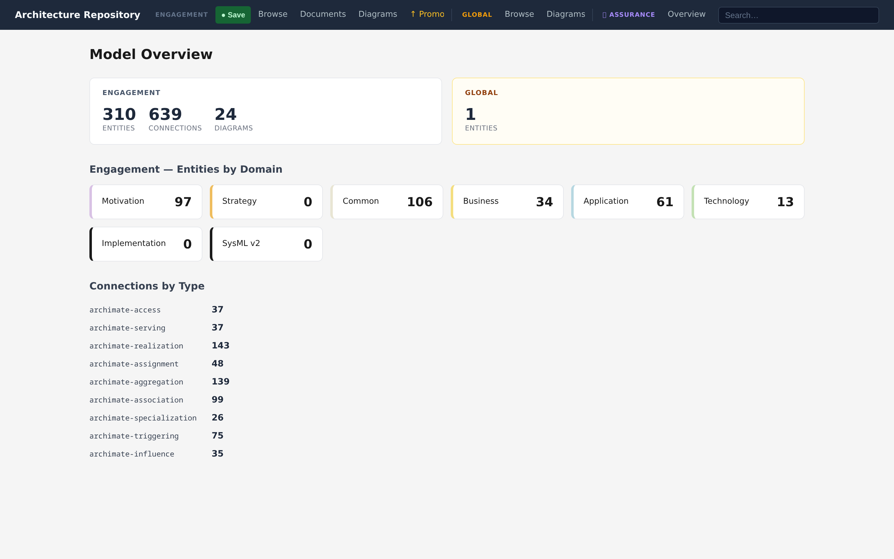
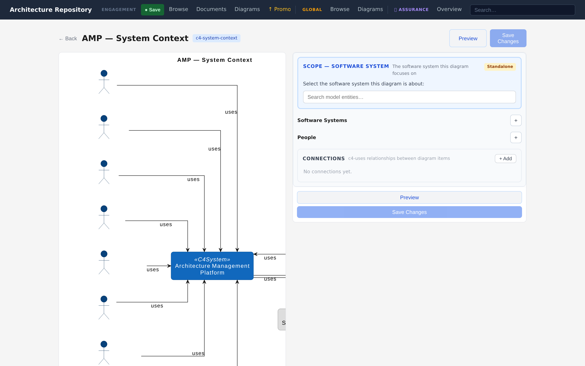
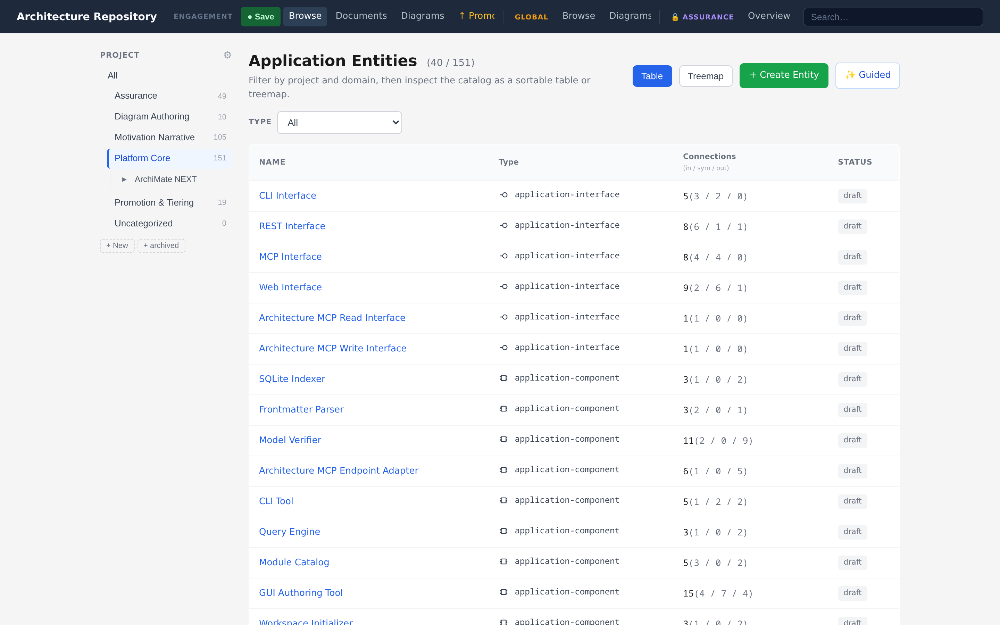

<div align="center">

# Architectonic

**Architecture, as code — for humans and AI.**

Treat software architecture as code: a typed, git-versioned, verifiable model that humans
edit in a browser and AI agents edit through MCP tools, with safety, security, and compliance
assurance built in.

[](https://github.com/mbauer83/architectonic/actions/workflows/ci.yml)
[](https://codecov.io/gh/mbauer83/architectonic)
[](LICENSE)
[](pyproject.toml)
[](tools/gui)

[](pyproject.toml)
[-2A6DB0)](pyproject.toml)
[](docs/03-modeling/interfaces-and-mcp.md)
[-6F42C1)](docs/01-motivation.md)
[](docs/04-assurance/index.md)

[Quickstart](#quickstart) · [Documentation](docs/index.md) · [Why it exists](docs/01-motivation.md) · [Assurance](docs/04-assurance/index.md)

<!-- media: docs/media/hero-overview.png — captured in Phase B (controlled 1440×900 @2x) -->


</div>

---

AI agents now write code faster than architecture can be reviewed by hand. Slide decks, wiki
pages, and loose spec files give an agent nothing reliable to query or verify; structured
modelling tools hold the relationships but treat agent access as an afterthought, so agents
can read the model yet cannot safely author and verify against it. This project makes
architecture a typed graph of entities and connections — version-controlled markdown with
structured frontmatter — that both people and agents read, author, and verify through the
same store.

The repository **models its own architecture**. The screenshots throughout these docs are the
tool describing itself: its components, requirements, decisions, and diagrams all live in
[`engagements/ENG-ARCH-REPO/`](engagements/ENG-ARCH-REPO/) and are browsable in the running
app.

&nbsp;

## What you get

| | Capability | Details |
|---|---|---|
| 🗺️ | **A typed architecture graph** | Entities and connections across motivation → strategy → business → application → technology, geared toward the ArchiMate NEXT draft | 
| 🔍 | **Browse and explore** | List, treemap, full-text search, and interactive graph navigation — *what connects to this, and how far to that?* |
| 📐 | **Diagram families** | ArchiMate views, C4 (model-backed), UML activity, sequence & class (datatype), and relationship matrices |
| ✅ | **Always-on verification** | Schema, referential integrity, cross-repo rules, and PlantUML syntax checked on every write |
| 🤖 | **AI-native access** | A split read/write MCP server exposes the model as typed tools; the same capability is in the GUI, REST API, and CLI |
| 🏢 | **Two-tier repositories** | Draft in an engagement repo, promote curated content to a shared enterprise baseline |
| 🛡️ | **First-class assurance** | Confidential STPA/CAST/GRC analysis, linked to the model, with a tamper-evident archive |
| 🧩 | **Modular everywhere** | Pluggable ontologies, diagram types, schemata, and storage backends over a hexagonal core |

&nbsp;

## See it

The model-backed **C4** view derives its content from the ArchiMate graph and verifies the
result live before you save:

<!-- media: docs/media/diagram-c4-create.png -->


The **entity catalog** is filterable by project, domain, and type, with connection counts and
the specialization hierarchy shown inline:

<!-- media: docs/media/entities-list.png -->


More walkthroughs — graph exploration, diagram authoring, promotion, and assurance — are in
the [documentation](docs/index.md).

&nbsp;

## Quickstart

**Prerequisites:** Python 3.13, [`uv`](https://docs.astral.sh/uv/), Java 11+, and Graphviz
≥ 2.49.0. Per-OS install steps (macOS, Debian/Ubuntu, WSL2, Docker) are in
[Installation & Setup](docs/02-installation.md).

```bash
# 1. Clone
git clone https://github.com/mbauer83/architectonic.git
cd architectonic

# 2. Install dependencies and the diagram runtime
uv sync --group dev --group gui
get-plantuml && check-diagram-runtime

# 3. Resolve the workspace (uses the bundled self-describing model)
arch-init

# 4. Start the unified backend (REST :8000, MCP :8000/mcp, GUI at /)
arch-backend --daemon
```

Open **http://localhost:8000** for the GUI, or query the model directly:

```bash
curl http://localhost:8000/api/stats
```

### Give an AI agent access

Point any MCP client (Claude Code, VS Code, …) at the two servers:

```json
{
  "mcpServers": {
    "arch-repo-read":  { "command": "uv", "args": ["run", "arch-mcp-stdio-read"] },
    "arch-repo-write": { "command": "uv", "args": ["run", "arch-mcp-stdio-write"] }
  }
}
```

The agent can then `artifact_query_search_artifacts`, walk the graph with
`artifact_query_find_neighbors`, and author with `artifact_create_entity` /
`artifact_add_connection` — every write validated by the same verifier the GUI uses. See
[Interfaces & MCP](docs/03-modeling/interfaces-and-mcp.md).

&nbsp;

## Documentation

| # | Section | Contents |
|---|---|---|
| 1 | [Motivation, Ideas, Goals & Scope](docs/01-motivation.md) | Why the project exists; goals, principles, and explicit non-goals |
| 2 | [Installation & Setup](docs/02-installation.md) | Per-OS prerequisites, dependency groups, backend, MCP, quality checks |
| 3 | [Architecture Modeling](docs/03-modeling/index.md) | Projects, views, graph exploration, diagramming, the MCP/REST surface |
| 4 | [Assurance — Safety, Security, GRC](docs/04-assurance/index.md) | STPA/CAST/GRC methods, assurance diagrams, confidential storage |
| 5 | [Extensibility](docs/05-extensibility/index.md) | Profiles, document types, ontology & diagram-type modules, hexagonal core |
| — | [Reference](docs/reference/configuration.md) | Configuration, CLI, git sync & promotion |

&nbsp;

## Status

Pre-1.0 and under active development. The model is geared toward the **ArchiMate NEXT draft**;
it makes no claim of conformance with any published standard. The assurance capability spans
STPA, STPA-Sec, CAST, GRC, and supply-chain signal ingestion.

&nbsp;

## Contributing & quality gates

Before committing, run the gates from the workspace root:

```bash
uv run pytest --tb=short -q
uv run ruff check src
uv run zuban check
```

Frontend checks (`npm run lint`, `npm run typecheck`) run from `tools/gui`. CI runs all of
these on every push and pull request.

&nbsp;

## License

[MIT](LICENSE) © 2026 Michael Bauer
