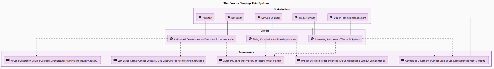
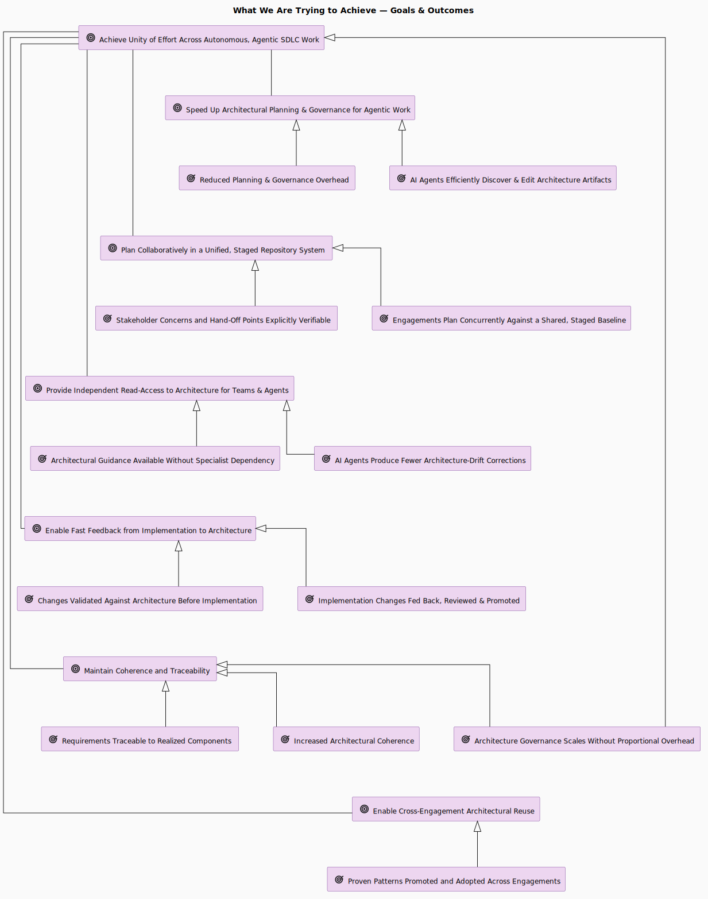
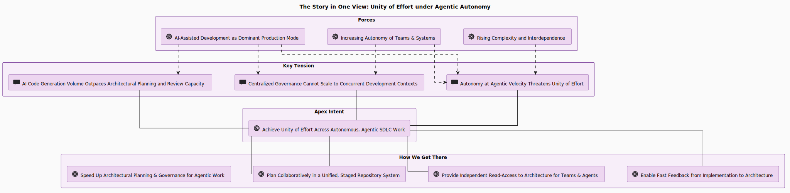

# Motivation, Ideas, Goals & Scope

This page contains a condensed overview of the motivation for this project. Every driver,
goal, outcome, principle, and requirement summarised here is contained in the project's self-model — see [`engagements/ENG-ARCH-REPO/`](../engagements/ENG-ARCH-REPO/) and browse it
live through the GUI or the `arch-repo-read` MCP tools after a demo setup.

&nbsp;

## The forces at work

Five durable trends shape the problem this project addresses.

*Rendered from the self-model. Open the diagram in a running app:
[`the-forces-shaping-this-system`](http://localhost:8000/diagram?id=ARC%401777455142.cFB8Hs.the-forces-shaping-this-system).*

**AI-assisted development as the dominant production mode.** LLM-based coding agents are vastly increasing the volume and velocity of code output. This shifts the economics of production, and creates new demands on architectural planning, governance, knowledge management, and assurance work. 

**Rising software complexity and interdependence.** As systems grow, the dependencies
between components, services, teams, and stacks increase non-linearly. Tracing how a change
in one place ripples through the rest increasingly requires structured architecture work. 

**Increasing demand for autonomy of teams and systems.** Recently driven in particular by the vastly increased iteration speed and volume of agentic work in the software-development lifecycle, organisational design keeps moving
toward more autonomy for teams and subsystems, who need to be enabled to align their work semi-autonomously without being bottlenecked by frequent, highly centralized coordination.

**Expanding software and AI assurance obligations.** Safety, security, and assurance-evidence
expectations for software and AI systems keep growing, and they increasingly reach smaller organizations and 
teams. The EU AI Act, the Cyber Resilience Act, and sector-specific safety standards are representative of the trend. 

**A safety, security, and GRC capability gap for small teams.** Small to medium teams and organizations, which produce the majority of software, rarely have dedicated assurance tooling, and the method and legal expertise needed for
rigorous safety, security, and compliance analysis is expensive. 

&nbsp;

## Where current practice breaks down

Architecture knowledge usually lives in slide decks, wiki pages, loose spec files used to
steer coding agents, or siloed modelling tools. Against the forces above, each of these
arrangements runs into hard limits:

**AI code generation outpaces sequential architectural review.** Review capacity that
  assumes human-paced change cannot keep up with agentic output.

**Centralised governance does not scale well to concurrent development contexts.** Highly centralized planning and implementation-guidance stalls autonomous teams and agents working in parallel - as concurrent work increases, centralized integration efforts cannot be proportionally effective to maintain the same level of coherence.

**LLM agents cannot use unstructured architectural knowledge effectively.** Prose scattered
  across unstructured or semi-structured document-collections or in non-AI-native tooling gives an agent no simple and effective way to query, navigate, or verify intent and constraints.

**Architecture tools without first-class agent access put avoidable manual upkeep on people.**
Structured modelling tools capture relationships well, but where agent access is bolted on
after the fact — an export here, a read-only API there — an agent cannot discover, author,
and verify model content through typed, validated operations. Routine updates an agent could
make safely then fall to people too, on top of the design and review that genuinely needs
human judgement — and the model drifts from the system as agentic output accelerates.

**Implicit interdependencies become unmaintainable without explicit models.** Relationships, reasonings, constraints and dependencies that live only in people's heads dilute and become increasingly difficult to manage as the managed system(s) and the teams grow. Even as code becomes commodified by agentic work, increasing cost and risk is still incurred by growth without explicit architectural intent, governance and knowledge-management. 

**Assurance disconnected from architecture loses traceability**, and **assurance cannot keep
  pace with agentic development velocity** — findings drift out of sync with the system they
  describe.

&nbsp;

Avoiding such risks and costs enables teams to take full advantage of the velocity enabled by agentic work while maintaining unity of effort leading to more coherent, well-designed, and well-documented systems.

&nbsp;

## What the project aims for

The goals fall into three groups:

*Rendered from the self-model. Open the diagram in a running app:
[`what-we-are-trying-to-achieve`](http://localhost:8000/diagram?id=ARC%401777452513.d8jG_4.what-we-are-trying-to-achieve).*

**Move faster without losing coherence**
- Speed up architectural planning and governance for agentic work.
- Achieve unity of effort across autonomous, agentic SDLC work.
- Maintain coherence and traceability as humans and agents edit together.

&nbsp;

**Make architecture reachable and reusable**
- Give teams and agents independent read-access to the architecture.
- Plan collaboratively in a unified, staged repository system.
- Enable cross-engagement architectural reuse.
- Enable fast feedback from implementation back to architecture.

&nbsp;

**Lower the floor for rigorous assurance**
- Provide first-class assurance over the architecture model.
- Provide guided workflows to lower the barrier to rigorous safety, security, and compliance work.

&nbsp;

## Guiding principles

Four principles constrain how the system is built.

**Architecture work is accessible through both human and agent interfaces.** Discovery,
authoring, and verification are reachable for people through a GUI and CLI-tools for setup & configuration — and primarily through MCP for agents.

**Extensibility and configurability at multiple levels.** Frontmatter schemata, attribute
schemata, valid entity and connection types, and directory conventions are all configurable
through git-based config, at both enterprise and engagement scope. The ontology extends
beyond the base ArchiMate NEXT vocabulary. The system adapts to an organisation without
forking the core.

**Safety is never treated as subordinate to risk.** Safety constraints stay absolute — cost, schedule,
and risk-acceptance decisions cannot override them. A hard safety-disposition safeguard runs
on every assurance write to enforce this in the tooling, not just on paper.

**Assurance content is confidential by default.** Assurance artefacts, signals (SBOMs), and
references are encrypted at rest, TLP-tagged ([Traffic-Light Protocol](https://en.wikipedia.org/wiki/Traffic_Light_Protocol)), reachable only through gated interfaces, and
carry one-way references to architecture that are never reverse-persisted.

&nbsp;

## Solution strategy

The strategy follows directly from those goals and principles.

*Rendered from the self-model. Open the diagram in a running app:
[`the-story-in-one-view`](http://localhost:8000/diagram?id=ARC%401780220700.Un4jQZ.the-story-in-one-view).*

- **Treat architecture as code.** Artifacts are structured, version-controlled markdown with
  typed frontmatter, committed to git with authorship and history — queryable, diffable, and
  reviewable like any other code.
- **Run a two-tiered repository.** An *enterprise* repo holds the organisation-wide baseline;
  per-project *engagement* repos hold local detail and draft work. An explicit, traced
  *promotion* step moves proven content up to the shared baseline.
- **Make access AI-native.** An MCP server exposes the model to agents as typed tools, so an
  agent can query, search, navigate relationships, author, and promote without knowing the
  file layout — and humans get the same capabilities through a GUI, REST API, and CLI.
- **Verify continuously.** A built-in verifier enforces referential integrity, schema
  conformance, diagram syntax, and cross-repo reference rules on every write and on demand,
  so the model stays consistent while humans and agents edit it together.
- **Make assurance first-class.** Safety (STPA, CAST), security (STPA-Sec, supply-chain
  signals), and GRC analysis attach directly to the architecture entities they describe,
  stored confidentially and backed by a tamper-evident archive.

&nbsp;

## Outcomes we expect

If the strategy holds, the effects fall into the same three groups as the goals.

**Coherence keeps pace with velocity.** Planning and governance overhead falls, and
governance scales without a matching rise in coordination effort. Agents author against a
verified model, so they produce fewer architecture-drift corrections, and changes are
checked against the architecture before they are built rather than after.

**The architecture becomes a shared, reusable asset.** Architectural guidance is available
without a specialist in the room, requirements stay traceable to the components that realise
them, and patterns proven in one engagement are promoted and reused across others.

**Rigorous assurance comes within reach.** Assurance findings stay traceable end-to-end to
the model, the friction and guidance overhead of safety, security, and compliance work drop,
and the analysis itself surfaces gaps in the architecture that were otherwise invisible.

&nbsp;

## Who it serves

The motivation layer names seven stakeholders: **Architect**, **Developer**, **DevOps
Engineer**, **Product Owner**, **Upper Technical Management**, **Risk & Compliance Officer**,
and **Safety / Security Analyst**. The dual human/agent interface principle exists so each of
them — and the agents working alongside them — can reach the same model.

&nbsp;

## Scope and non-goals

**In scope**
- Modelling architecture toward the ArchiMate NEXT draft vocabulary, plus extension
  ontologies and diagram families (UML activity, sequence, C4, matrices, and assurance views).
- A git-versioned, two-tier artifact store with a verifier, exposed through MCP, REST, CLI,
  and a browser GUI.
- A confidential, separately-stored assurance capability for safety, security, and GRC work,
  linked to the architecture model.

**Out of scope / deliberate non-goals**
- **Conformance claims.** The model is *geared toward* the ArchiMate NEXT draft. It does not
  claim conformance with any published standard — the draft is moving, and so is this work.
- **Full feature parity across every interface.** Each surface covers the core; depth varies
  by interface on purpose.
- **A hosted multi-tenant service.** This is workspace-local tooling backed by your own git
  remotes, not a SaaS platform.
- **Replacing your CI, issue tracker, or git host.** The promotion and review workflow is
  designed to sit on top of any git hosting platform without requiring API integration.

---

*Continue to [Installation & Setup →](02-installation.md) or jump to
[Architecture Modeling →](03-modeling/index.md).*
