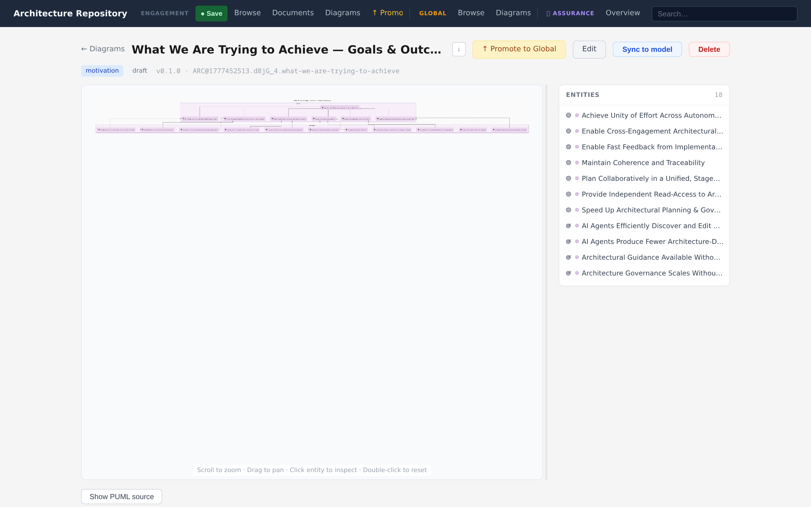
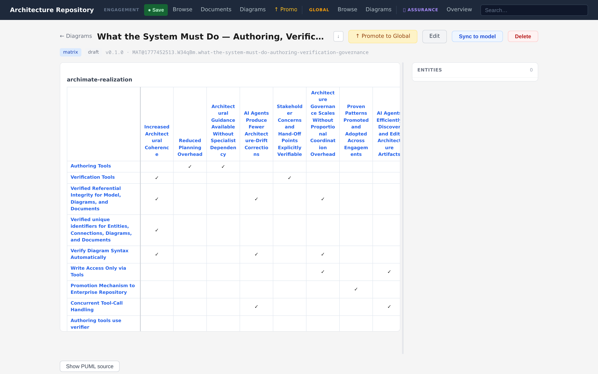
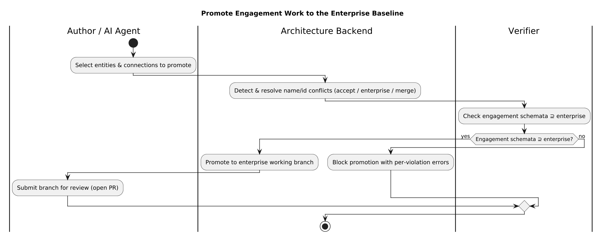
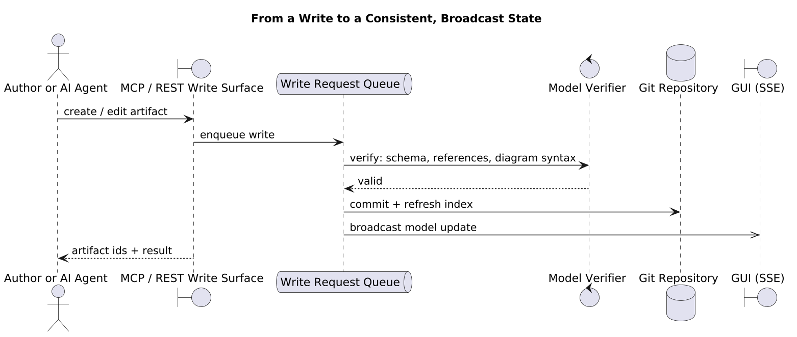
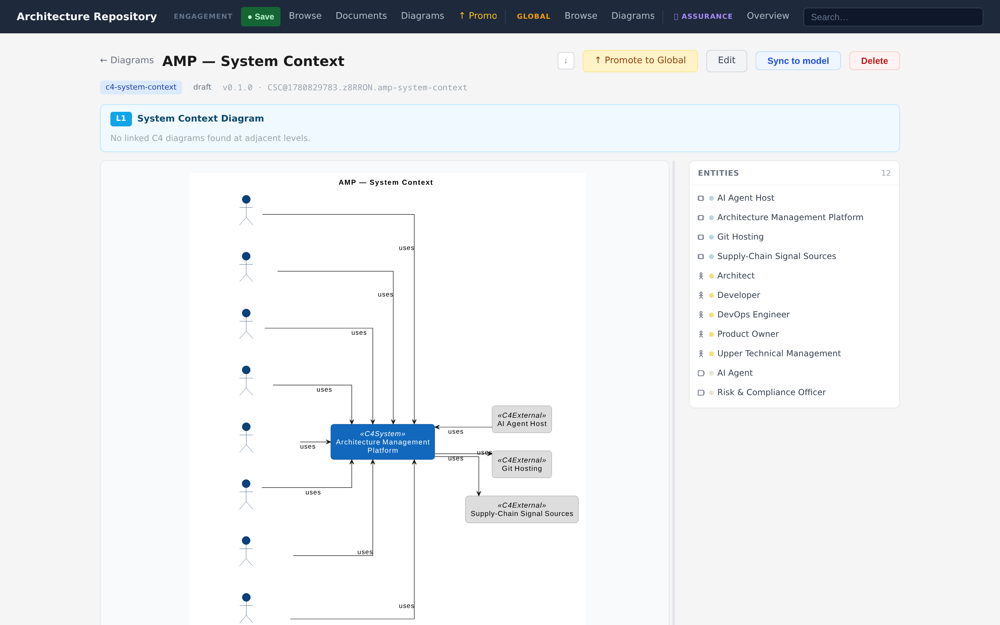

# Diagramming

Diagrams are views over the model. A **diagram type module** declares which entity and
connection types a view accepts and how it renders. Most ArchiMate views are config-only and
share the `GenericPumlRenderer`; families with their own notation (activity, sequence,
matrix, C4) bring a custom renderer. The full extension contract lives in
[`src/diagram_types/README.md`](../../src/diagram_types/README.md) and is summarised for
authors in [Diagram-type modules](../05-extensibility/diagram-type-modules.md).

Two kinds of content can appear in a view:

- **Model entities** — real entities from the store, referenced by `entity_id`. Editing the
  diagram never mutates them.
- **Diagram-only entities** — types that live only inside a diagram's `diagram-entities:`
  frontmatter (swimlanes, sequence participants, C4 boundaries). They are never written to
  the model store.

&nbsp;

## ArchiMate views

One view per domain — **motivation, strategy, business, application, technology,
implementation** — plus a **layered** view that spans all domains. These are config-backed:
each `config.yaml` sets the domain filter, grouping, and layout hints, and the shared
ArchiMate renderer handles stereotypes, glyphs, nesting, and flow arrows. Connection
descriptions stay hidden unless a diagram explicitly opts in per connection.

&nbsp;

## Matrix

A free-ontology view that accepts every entity type and renders as a Markdown table rather
than PlantUML. Use it for relationship matrices — for example, requirements against the
components that realise them, or stakeholders against concerns. Authored and edited through
the dedicated matrix create/edit flow.

&nbsp;

## Activity (UML)

A UML activity view with **swimlanes** as diagram-only entities. Actions are placed in lanes,
lanes map to model roles or actors, and notes attach to steps. Structural relationships
(step-in-lane, note-of) are stored in the diagram's `connections:` list, not as properties,
and the custom renderer builds the swimlane layout from them.

&nbsp;

## Sequence (UML)

A UML sequence view with participants and ordered messages, linked by stable local ids. The
GUI provides a bespoke editor (wired through the diagram type's `type_ui_slots`) for adding
participants and messages without hand-editing frontmatter.

&nbsp;

## C4

A progressive zoom across three levels — **system context** (L1), **container** (L2), and
**component** (L3). C4 views are **model-backed**: a projection engine derives view content
from the ArchiMate graph (a software system, its containers, its components), so the diagram
stays consistent with the model. Parent/child navigation moves between levels, and a
preview/refresh path shows what a projection will include before it is saved.

&nbsp;

## Authoring a diagram

The GUI authoring flow is the same shape across families:

1. **Pick entities** through a search filter scoped to the view's accepted types.
2. **Expand related entities** — pull in neighbours of what you have already placed.
3. **Manage connections** side by side with the entity list.
4. **Preview the PlantUML live**, then render to SVG.

Rendered SVGs are interactive: click an entity to open it, and follow its relationships
visually.

Agents get the same capability through the MCP write tools, plus two helpers:

- **`artifact_diagram_scaffold`** — produce a starting diagram skeleton for a chosen type.
- **`artifact_authoring_guidance`** — return each diagram type's `when_to_use` /
  `when_not_to_use` guidance and accepted vocabulary, so an agent picks the right view before
  authoring.

See [Interfaces & MCP](interfaces-and-mcp.md) for the full tool surface.

---

*Next: [Interfaces & MCP →](interfaces-and-mcp.md)*
