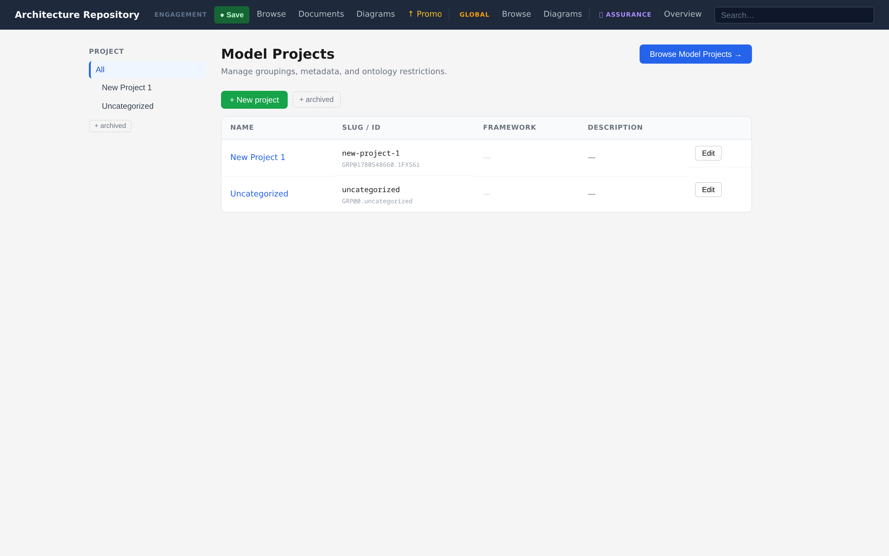

# Projects & Grouping

Growing repositories stay navigable through **three independent grouping axes**, one per
artifact family.

| Axis | Artifact family | Directory layout |
|---|---|---|
| **Model-project** | Entities + connections | `projects/<slug>/model/<domain>/<type>/…` |
| **Diagram-collection** | Diagrams | `diagram-catalog/diagrams/<slug>/…` (+ `rendered/<slug>/`) |
| **Document-collection** | Documents | `docs/<doc-type-subdir>/<slug>/…` |

The axes are mutually independent — a diagram collection is never tied to a model-project.
Grouping is a **soft partition**: it controls where files live and nothing else. Search,
linking, and verification ignore group boundaries entirely.

Groups exist at both tiers — each repository carries its own group registry. Promotion
maps each engagement group to an enterprise group: a group promoted before is matched by
its registry id and receives the new content in place; a same-slug enterprise group with
a different identity is flagged as a conflict to resolve; and a group new to the
enterprise tier is created with an engagement-qualified default slug
(`{engagement-label}-{slug}`), so two engagements that independently named a group
"assurance" cannot silently merge. The promoting user can override any mapping — for
example to merge into an existing enterprise group deliberately. See
[Git sync & promotion](../reference/git-sync-promotion.md#promotion).



&nbsp;

## Working with groups

**Lifecycle** — through the `artifact_group` MCP tool or the REST `*/api/group*` endpoints:

- `create` — register a new group (target = slug)
- `rename` — change display name or slug (safe subtree `git mv`)
- `archive` / `unarchive` — hide or restore from default pickers
- `delete` (diagram / document collections) — remove folder + contents; typed confirmation
  required
- `delete` (model-project) — a two-stage cascade: run with `dry_run=True` for a preflight
  impact report, then apply

**Create or edit with a group** — `artifact_create_entity`, `artifact_create_diagram`,
`artifact_create_document`, and their `edit_*` counterparts all take an optional `group`
parameter:

- at create time, the artifact is placed in that group's directory
- at edit time, the artifact is re-homed to a new group with a safe `git mv`

Group authoring is intentionally out of scope for the CLI; use the MCP tools or the REST/GUI
surface.

&nbsp;

## Migrating existing content

Migration into the grouped layout is idempotent and per-repo:

```bash
uv run python -m src.infrastructure.workspace.migrate_to_groups
```

---

*Next: [Views & exploration →](views-and-exploration.md)*
