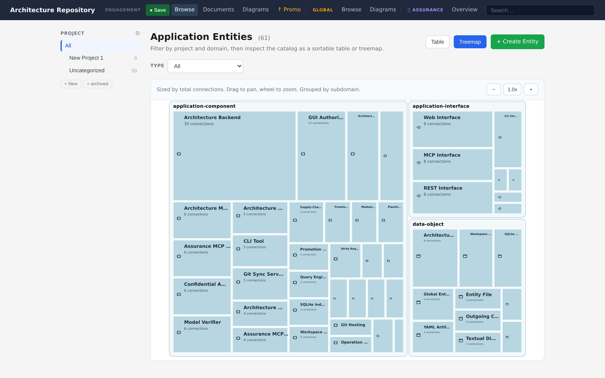
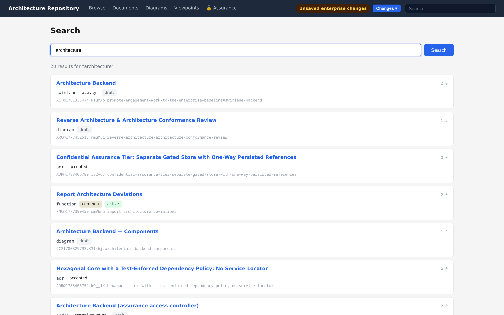
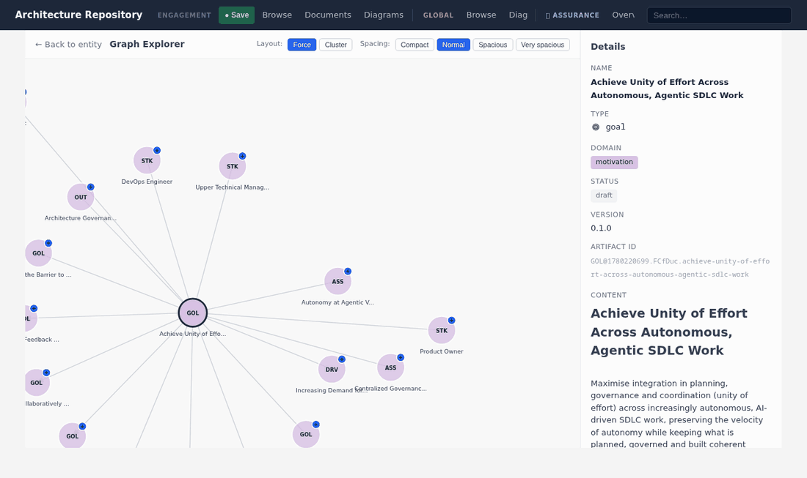
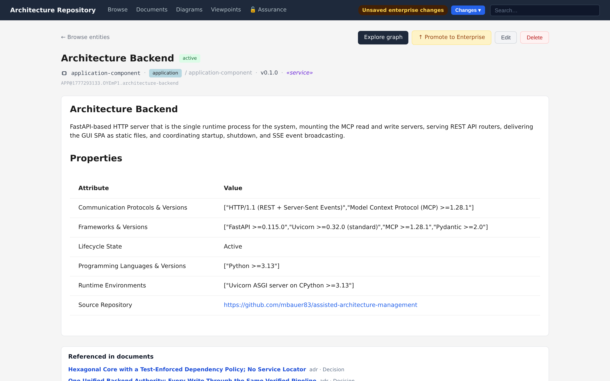

# Views & Exploration

The same artifact store is browsable several ways. Each view is available in the GUI for
people and as structured data through the MCP and REST surfaces for agents.

&nbsp;

## Overview

The home view summarises the workspace: engagement versus enterprise counts, and breakdowns
by domain and connection type. It is the fastest way to confirm what a repository contains
and which tier you are looking at.

&nbsp;

## List view

A filterable, sortable table of entities (and parallel list views for documents and a grid
for diagrams). Filter by domain, type, status, and keyword; full-text search narrows the
list as you type.

Every list surface carries the same **tier facet** — `All · Engagement · Enterprise`
(viewpoints add their built-in `module` tier) — persisted in the URL as `?tier=`, so a
copied link restores the exact tier you were looking at. Rows show a uniform tier badge,
and the enterprise tier is browsed through the same views rather than a separate section.
Engagement collections (groups) apply only outside the Enterprise tier; selecting
Enterprise clears the active collection.

&nbsp;

## Treemap

A space-filling map of entities, sized and grouped so the shape of a repository is visible
at a glance — which domains and types dominate, and where the gaps are. Drill in to focus a
domain or type.

&nbsp;

## Search

Full-text search across every artifact family (entities, connections, diagrams, documents)
with relevance ranking, plus optional semantic supplement where configured. Results carry
enough metadata to act on without a second round-trip.

&nbsp;

## Graph exploration

Relationships are first-class. The graph explorer starts from any entity and lets you walk
the connection graph interactively: *what connects to this, and how many hops to reach that
concept?* Expand a node to pull in its neighbours, follow specialization / composition /
aggregation hierarchies, and trace cross-domain dependencies that would otherwise stay
implicit.

For agents, the same traversal is available through `artifact_query_find_neighbors` and
`artifact_query_find_connections_for` — see [Interfaces & MCP](interfaces-and-mcp.md).

&nbsp;

## Entity detail and connection authoring

Opening an entity shows its full content, properties, and connections grouped into
**incoming**, **symmetric**, and **outgoing**. Each connection type the ontology permits for
this entity gets its own row with a **+** to add a connection and an inline **×** to remove
one, so relationships are authored where the entity lives rather than in a separate editor.
The permitted target types come straight from the connection ontology, so the editor only
offers links the verifier will accept.

---

*Next: [Diagramming →](diagramming.md)*
