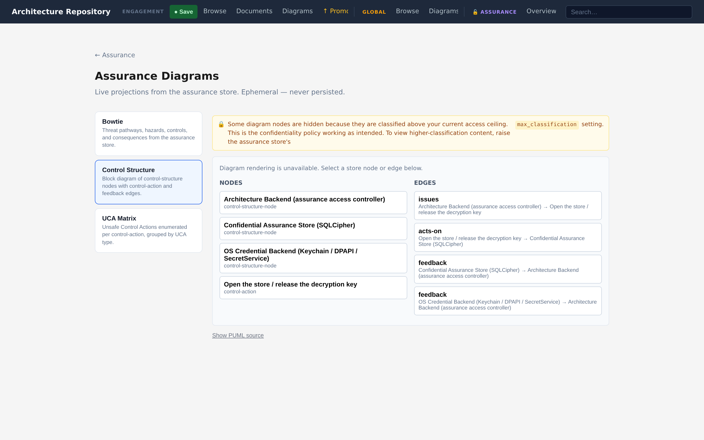
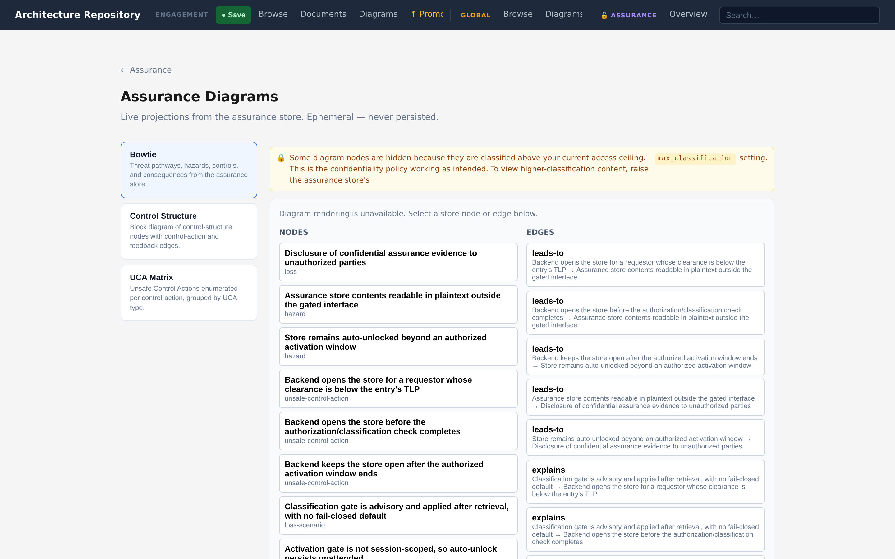
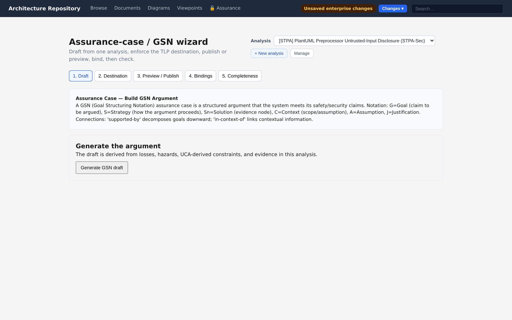

# Assurance Diagrams

Four diagram families visualise an assurance analysis, each a diagram type module under
`src/diagram_types/`.

| Diagram | Module | Reads from | Viewer |
|---|---|---|---|
| STAMP control structure | `control_structure` | Control-structure nodes + control actions | Assurance viewer |
| UCA matrix | `uca_matrix` | Control actions × STPA guidewords | Assurance viewer |
| Bowtie | `bowtie` | A hazard, its threats, consequences, and barriers | Assurance viewer |
| Assurance case (GSN) | `gsn` | Goals, strategies, solutions/evidence | Generic + assurance bridge |

Assurance diagrams are **never written as plaintext to disk** — the renderer refuses to emit
into `diagram-catalog/rendered/`, keeping confidential analysis out of the clear. The figures
below are the project's **own** STPA-Sec analysis of its confidential assurance store
(a worked, self-describing example), rendered for this documentation.

&nbsp;

## Unified assurance diagram viewer

Bowtie, STAMP control structure, and UCA matrix open in the **assurance diagram viewer**,
not in the generic architecture diagram viewer. This surface:

- Applies the `AssuranceExposurePolicy` to every response — nodes and edges above the
  configured TLP ceiling are never sent to the client.
- Renders the diagram from the live store graph rather than a stored `.puml` file, so it
  always reflects the current analysis state.
- Supports **interactive node and edge selection**: clicking any node or edge opens an
  assurance detail panel on the right with the node's name, type, status, description,
  architecture bindings, and a link to the full node-edit view.
- Falls back to a selectable store-grounded entity list when PlantUML is unavailable.

The three assurance-only types are **not listed in the generic diagram browser** — they cannot
be opened through the architecture diagram catalogue, so there is no risk of encountering a
broken, unfiltered, or non-selectable view of confidential content.

&nbsp;

## STAMP control structure

The backbone of an STPA/STAMP analysis: controllers, controlled processes, and the control
actions and feedback between them. Binding a node to an architecture entity ties the analysis
to the real system; an unbound node renders as a visible modelling gap. Here the **Architecture
Backend** controls *Open store / release key* over the **SQLCipher store** and the **OS
credential backend**.

&nbsp;

## UCA matrix

Every control action against the four STPA guidewords. A populated cell is an unsafe control
action; an empty cell is a context that is safe (or still to analyse). For the single control
action above:

| Control action | Not provided | Provided | Wrong timing | Stopped too soon |
|---|---|---|---|---|
| **Open store / release key** | — *(store stays locked — safe)* | **UCA1** — opens for a requestor whose clearance is below the entry's TLP → *plaintext-disclosure hazard* | **UCA2** — opens before the clearance check completes → *plaintext-disclosure hazard* | **UCA3** — kept open past the authorized activation window → *auto-unlocked-too-long hazard* |

&nbsp;

## Bowtie

A bowtie centres on a hazard (the "top event"), with threat pathways on the left and
consequences on the right, and the barriers that interrupt each pathway between. It reads well
for communicating one hazard's risk picture to stakeholders who do not work in STAMP terms.

&nbsp;

## Assurance case (GSN)

A Goal Structuring Notation view of the argument that the system is acceptably safe or secure:
top-level goals, the strategies that decompose them, and the solutions and evidence that
discharge them. This is the artifact a regulator or auditor expects, assembled from the same
store as the analysis it argues over.

### GSN dual-home

GSN is the only assurance diagram type with a dual home:

| Classification | Where it lives | How to access |
|---|---|---|
| `TLP:WHITE` / `TLP:GREEN` | Architecture repository as a `gsn` diagram | Generic diagram viewer — selectable nodes/edges, detail panel |
| `TLP:AMBER` / `TLP:RED` | Assurance store only — rendered as a derived preview | Assurance viewer — same selection UX, exposure-filtered |

Publishing a `TLP:WHITE` or `TLP:GREEN` GSN draft to the architecture repository is audited in
the assurance store. The architecture repository never gains back-references to the confidential
source analysis.

&nbsp;

---

*Next: [Storage & confidentiality →](storage-and-confidentiality.md)*
