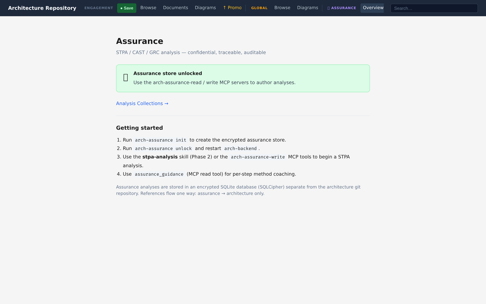
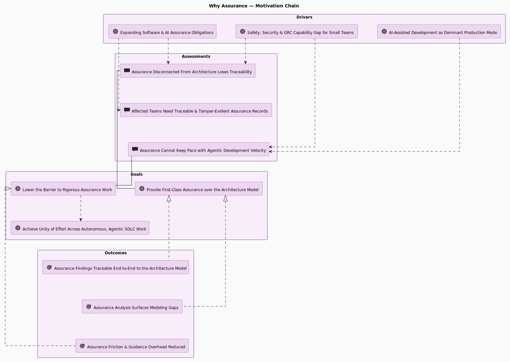

# Assurance — Safety, Security, Governance, Risk & Compliance

> A confidential evidence capability for rigorous safety, security, and compliance work,
> linked to the architecture model and stored separately from it.

Assurance content — hazard analyses, incident data, risk registers, compliance obligations —
is sensitive. It lives in its own encrypted store, not in the architecture model's git
history, while staying linked to the architecture entities it describes. Two principles
govern the capability:

- **Safety is never subordinate to risk.** Safety constraints stay absolute; a hard
  safety-disposition safeguard runs on every assurance write so no cost, schedule, or
  risk-acceptance decision can weaken them.
- **Assurance content is confidential by default.** Everything is encrypted at rest,
  TLP-tagged, reachable only through gated interfaces, and references to architecture are
  one-way and never reverse-persisted into the model.

The goal is to lower the barrier to assurance work for teams that lack dedicated tooling or
specialist method and legal expertise — guidance-first, with method-completion checks.



The assurance capability is not a separate sidecar concern. It is motivated by the same
forces as the architecture repository: agentic delivery raises change velocity, assurance
obligations keep expanding, and small teams need a way to make safety, security, and GRC
work traceable without building a dedicated assurance department.



*Rendered from the self-model. Open the diagram in a running app:
[`why-assurance-motivation-chain`](http://localhost:8000/diagram?id=ARC%401780656714.9qoEQO.why-assurance-motivation-chain).*

&nbsp;

## On this page set

| Page | What it covers |
|---|---|
| [Methods](methods.md) | STPA, STPA-Sec, CAST, GRC concepts; the analysis workflow — wizards, completeness review, baseline sealing |
| [Exploring assurance](exploring-assurance.md) | Browsing the store, deep-linkable node pages, budgeted graph traversal, ontology-driven edge authoring |
| [Diagrams](diagrams.md) | Bowtie, STAMP control structure, GSN assurance cases, UCA matrix; unified assurance viewer; GSN dual-home |
| [Security signals](security-signals.md) | SBOM ingest, signal snapshots, vulnerability identity, directness, impact analysis, VEX |
| [Storage & confidentiality](storage-and-confidentiality.md) | Store vs. archive, backends, credential storage, TLP ceiling, withheld content, WORM, WAL, CLI reference |
| [AI-BOM](aibom.md) | Model-derived CycloneDX ML-BOM: marking, model cards, derivation roles, coverage, export |
| [MCP tools](mcp-tools.md) | The assurance MCP server surface for AI agents |

&nbsp;

## The assurance model in one picture

The store holds a typed graph anchored on stakeholder **losses**:

```
loss ──caused-by──► hazard ──explained-by──► loss-scenario ──derives──► assurance-constraint
                       ▲                          ▲                            │
                       │                          │                            ▼
              unsafe-control-action ──concerns──► control-action        ArchiMate requirement
                       │                                                  (refines, one-way link)
              by-controller ▼
              control-structure-node  ◄── binds to an architecture entity (or flags a gap)

risk ──assesses──► hazard,  ──treated-by──► assurance-constraint        (GRC evaluation overlay)
incident ──reconstructs──► control structure as it existed             (CAST, sealed baseline)
obligation ──cites──► framework code (e.g. ISO26262:6-8)               (compliance instance)
```

Every type carries a `concern_class` (safety vs. security) where relevant, and constraints
carry a disposition and integrity level. A `control-structure-node` that is not yet bound to
an architecture entity is an explicit signal of a modelling gap — assurance analysis surfaces
holes in the architecture itself.

---

*Next: [Methods →](methods.md)*
