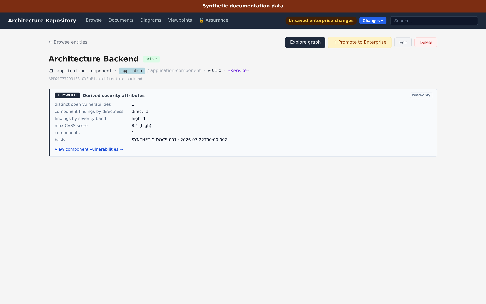
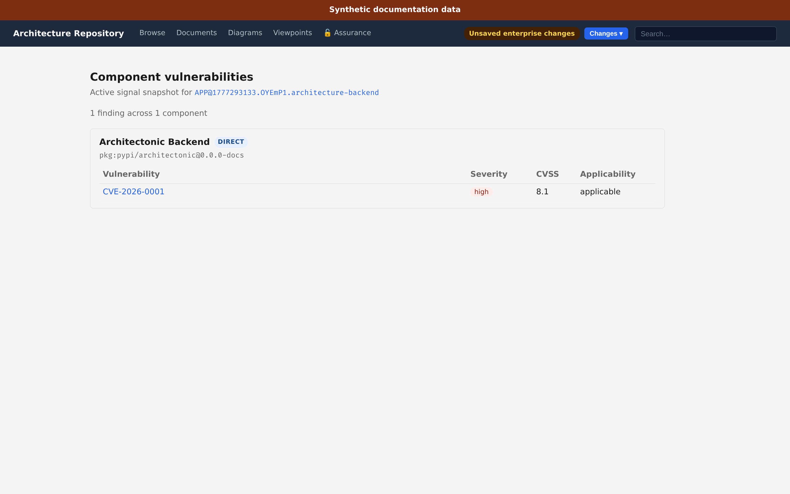
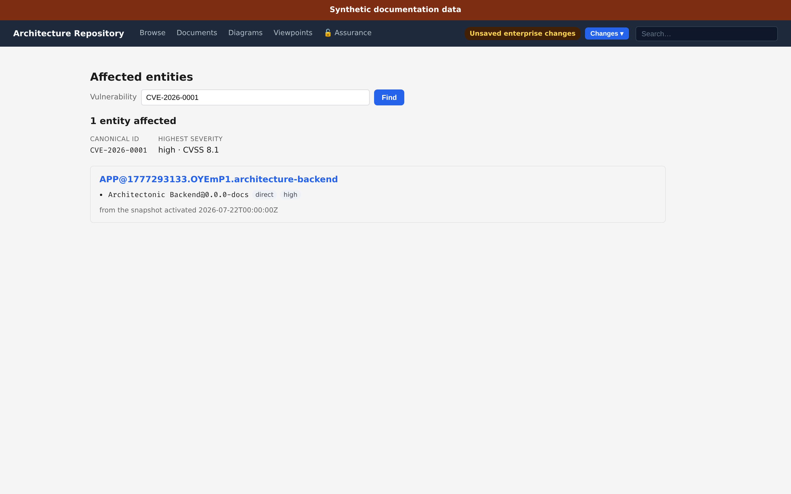

# Security signals — SBOMs, vulnerabilities, and impact

Security signals attach external supply-chain evidence to the architecture model:
which software components an architecture element is actually built from, which
vulnerabilities affect them, and which entities a given CVE reaches.

The model is deliberately small. One **ingest** produces one **signal snapshot**.
A snapshot belongs to one architecture entity — its *anchor* — and exactly one
snapshot per anchor is `active` at a time. Every read answers from the active
snapshot, so a figure on screen always has one identifiable basis rather than an
accumulation of scans.

```
ingest  ─┬─ CLI script      ┐
         ├─ arch-assurance  │   staging → complete → active
         ├─ MCP tool        ├──────────────────────────────▶  signal snapshot
         └─ REST endpoint   ┘        (supersedes the previous)
```

## Producing a snapshot

Ingest is a serialised, audited, idempotent act with one command behind every
surface, so no route can bypass the capability gate or the audit record.

| Route | Use it for |
|---|---|
| **Entity page → Ingest SBOM** | Ingesting a bill of materials for the element you are looking at |
| Supply-chain wizard → Ingest SBOM | The same act inside the guided scope→ingest→review flow |
| `arch-assurance seed --with-signals` | Bootstrapping a demo or a fresh store |
| `uv run tools/ingest_security_signals.py --target python --anchor <id>` | Dogfooding this repository |
| `assurance_ingest_security_signals` (MCP) | An agent holding a BOM and advisories |
| `POST /api/assurance/security-ingest` | Programmatic ingest |

### What may be anchored

An SBOM is a bill of materials for **one built, independently shipped artifact**,
and that is what constrains the anchor:

| Anchor | Why |
|---|---|
| `application-component`, unspecialized or `service` | A service is a shipped artifact; an unspecialized component is the same thing before anyone specialized it |
| `node` | A container image or host ships with a bill of materials |
| `system-software` | So does a database engine or runtime |

A `module` is a *part* of a shipped thing — its dependencies belong to the SBOM of
whatever ships it — and an `endpoint` is an interface, which is not built at all.
Aggregates (`grouping`, `application-collaboration`) do not ship as one thing.

This is **enforced, not advisory**: the ingest command checks the anchor before
writing anything and refuses an entity the model does not know, or one an SBOM
cannot describe. The vocabulary is owned by the backend and served from
`/api/assurance/signal-anchor-types`, so the ingest a GUI offers is the ingest the
API accepts.

`--target` selects the SBOM generator: `python` (cyclonedx-py over the uv
environment) or `npm` (`npm sbom` over the GUI workspace). Both preserve the
dependency graph, which is what makes directness classifiable.

Every surface reports **both** counts:

```
result: activated snapshot SNAP@840c9c7d9e614473
  components persisted:  107 (of 107 submitted)
  findings persisted:    24 (of 41 submitted)
  collapsed by alias:    17 (findings sharing one canonical vulnerability per component)
```

The delta is not loss. One component plus one canonical vulnerability is exactly
one finding, so advisories that turn out to name the same vulnerability collapse
into a single row. Reporting only the submitted count would promise a number the
next read cannot show.

### Idempotency

`request_id` is the replay key. Resubmitting the same id with the same payload
returns the original outcome and writes nothing; resubmitting it with a *different*
payload is a typed conflict, and nothing is written. Omit it and every call
ingests anew.

## Reading a snapshot

The architecture model is the entry point. An entity with an active snapshot
carries a read-only derived-attributes panel on its detail page:



Following **View component vulnerabilities** lists the findings grouped by the
component they affect, worst first:



Each vulnerability links to the entities it affects — the reverse question, and
usually the next one:



The same three views are available to agents as
`assurance_security_metrics`, `assurance_list_vulnerabilities`, and
`assurance_vulnerability_impact`, and over REST as `/api/assurance/security-metrics`,
`/api/assurance/security-findings`, and `/api/assurance/vulnerability-impact`.

## Vulnerability identity

Feeds name the same vulnerability differently — a CVE id, a GHSA id, a PYSEC id.
Ingest resolves each advisory's alias set onto one **canonical vulnerability**,
merging previously separate identities when a feed reveals they are the same.

This is why impact lookup accepts any identifier: asking about `GHSA-47FR-3FFG-HGMW`
and asking about `CVE-2026-7246` reach the same answer, because both resolve to
the same canonical id. Views display the identifier a reader recognises and
navigate by the canonical one.

A merge repoints every reference to the losing identity, including VEX
assessments, so an analyst's judgement follows the vulnerability rather than being
orphaned against a superseded id.

## Directness

Each component is classified `direct`, `transitive`, or `unknown` by its depth
from the SBOM's root component in the dependency graph. Directness answers "is
this something we chose, or something our choices dragged in", which usually
determines who can act on it.

Classification needs a *root*, not merely a dependency graph. An SBOM describing
an environment with no root component yields `unknown` for everything — which
reads exactly like a successful scan. The shipped generators always request one.

## What the numbers can and cannot tell you

**Exposure filtering happens before aggregation.** Records above your
classification ceiling are excluded from every count, maximum, and list — never
filtered afterwards, which would let a hidden record influence a visible figure. A
finding is withheld when its component is withheld, so the two never disagree.
Where anything was withheld, the surface says so; a filtered result is never
presented as a clean one.

**VEX is reported, not silently applied.** An entity assessed `not_affected` or
`fixed` still appears, carrying that disposition — dropping it would make a
consciously assessed entity indistinguishable from one that was never scanned.
Counts distinguish affected from open: `3 entities affected · 1 open, 2 suppressed
by VEX`.

**Only active snapshots count as current exposure.** A superseded snapshot is
history. An entity whose newer scan no longer reports a vulnerability is not
listed as affected by it.

## Deleting snapshots

`assurance_delete_security_snapshot` (MCP) and
`POST /api/assurance/security-snapshot-delete` remove one snapshot by id, or every
snapshot for an anchor. Deletion is irreversible and audited.

Deleting the active snapshot is allowed and leaves the anchor reporting
`no_active_snapshot`; no earlier snapshot is promoted back, because presenting a
stale scan as current truth is worse than presenting none. The snapshot's
components and findings go with it. Vulnerability identities, aliases, and VEX
assessments do **not** — they are shared or anchor-scoped and outlive any single
scan.

## Storage

Signals live in the confidential assurance store and inherit its gating: the store
must be unlocked, and every mutation lands an audit record in the same transaction
that writes it. See [Storage and confidentiality](storage-and-confidentiality.md).

In the default co-located backend the signals share a database file with the
STPA/CAST/GRC model. Repairs scoped to signals must therefore name the signal
tables — deleting the database file would destroy authored assurance content that
is not regenerable.
