# Showcase: The Platform's Own Model

This platform models itself: its motivation, strategy, runtime architecture, decisions,
and its own safety/security analysis all live in the bundled
[`engagements/ENG-ARCH-REPO/`](../engagements/ENG-ARCH-REPO/) repository and its
assurance store seed. This page is a guided read through that model — every stop names
the real artifact, with a deep link into a locally running app (default port assumed;
adjust the host if yours differs).

It comes in two parts, mirroring the boundary the product itself draws: the
**architecture model** (git-tracked, public) and the **assurance capability** over it
(separately stored, confidential by default — shown here from the platform's own
public self-model content).

&nbsp;

## Part 1 — From a force in the world to running code

**1. A driver and what it implies.** The model starts from the force reshaping software
work: [*AI-Assisted Development as Dominant Production Mode*](http://localhost:8000/entity?id=DRV%401776628131.GR9prv)
(driver), sharpened by the assessment
[*LLM-Based Agents Cannot Effectively Use Unstructured Architectural Knowledge*](http://localhost:8000/entity?id=ASS%401776628140.s68vVo).

**2. The goal it forces.** That pressure lands on the goal
[*Maintain Coherence and Traceability*](http://localhost:8000/entity?id=GOL%401712870400.Po1Qw3),
realized through the outcome
[*Increased Architectural Coherence*](http://localhost:8000/entity?id=OUT%401712870400.LrpdG0).

**3. The strategy that answers it.** The course of action
[*Dogfood via the Recursive Self-Model*](http://localhost:8000/entity?id=COA%401784483697.FI0Xbj)
influences that outcome, and is realized by the capability
[*Architecture Knowledge Management*](http://localhost:8000/entity?id=CAP%401784482403.pLMHKe) —
one of five capabilities on the
[capability map](http://localhost:8000/diagram?id=ARC%401784484044.GU6kjx.capability-map).
The full strategy layer is one view:
[Strategy Overview](http://localhost:8000/diagram?id=ARC%401784483951.yBNaaU.strategy-overview).

<!-- media: docs/media/strategy-overview.png — captured by the deterministic media suite -->
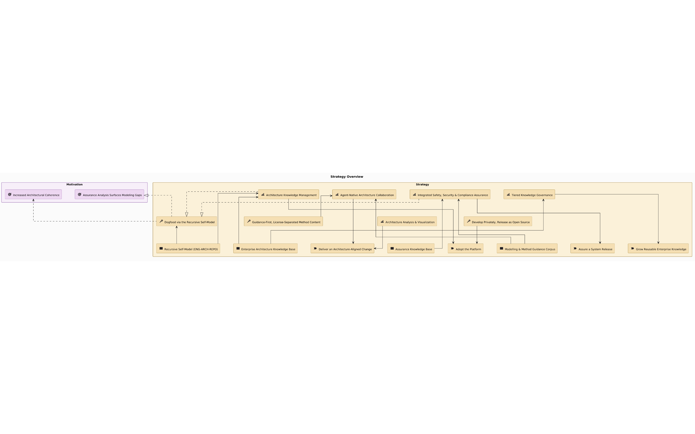

**4. The value it delivers.** That capability serves the value stream
[*Model & Validate the Architectural Design*](http://localhost:8000/entity?id=VS%401784483014.xrSjjJ) —
stage by stage, from scoping a change to feeding implementation learnings back — shown
end to end in
[*Deliver an Architecture-Aligned Change*](http://localhost:8000/diagram?id=ARC%401784483996.YRywG6.value-stream-deliver-an-architecture-aligned-change).
The [Resource Investment Map](http://localhost:8000/diagram?id=ARC%401784488894.WwyJAa.resource-investment-map)
renders the same strategy layer as a heat map over each resource's modeled
`investment_level`.

<!-- media: docs/media/value-stream-deliver-change.png -->
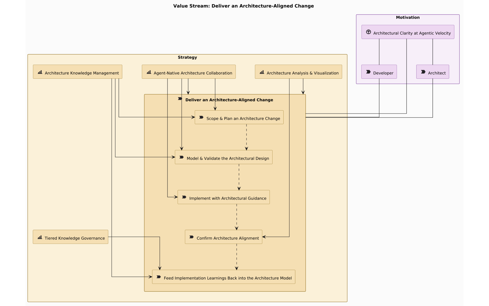

<!-- media: docs/media/resource-investment-map.png -->
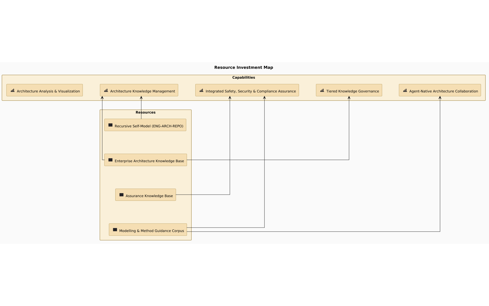

**5. Down to the running system.** The C4 progression describes the platform's own
runtime, model-backed at every level:
[System Context](http://localhost:8000/diagram?id=CSC%401780829783.z8RRON.amp-system-context) →
[Containers](http://localhost:8000/diagram?id=CC%401780829785.Z_fI-N.amp-containers) →
[Architecture Backend — Components](http://localhost:8000/diagram?id=CC%401780829793.K3l46j.architecture-backend-components).

<!-- media: docs/media/c4-context.png -->
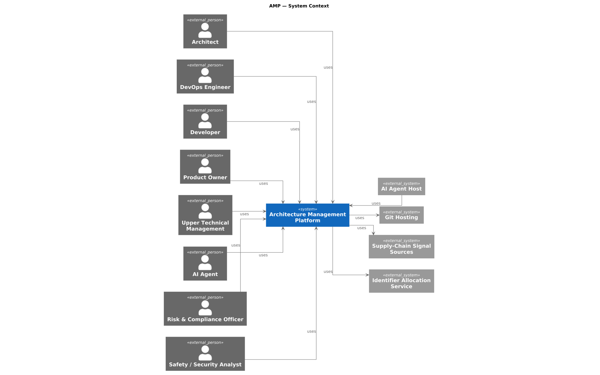

<!-- media: docs/media/c4-containers.png -->
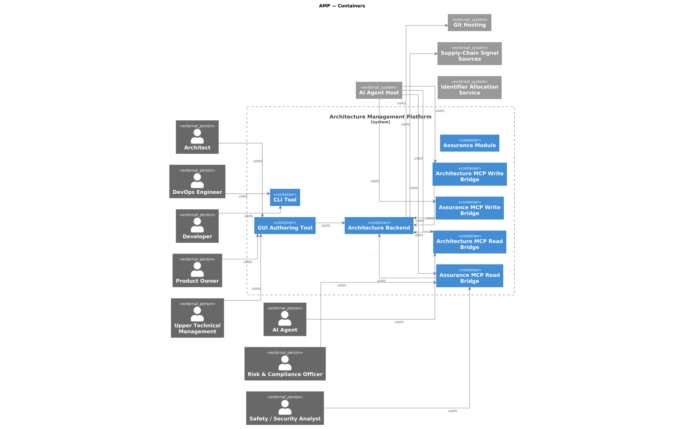

<!-- media: docs/media/c4-backend-components.png -->
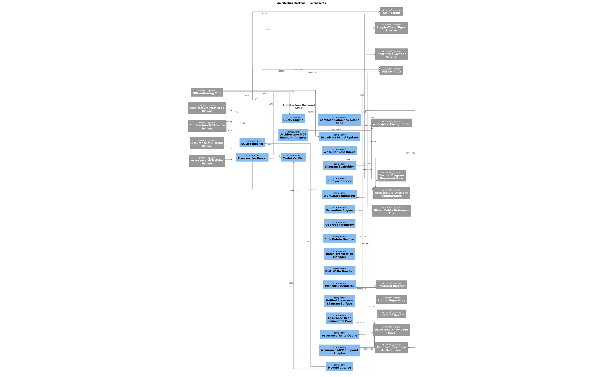

**6. And into its decisions.** From the
[Architecture Backend](http://localhost:8000/entity?id=APP%401777293133.OYEmP1) entity,
document backlinks lead to the ADRs that shaped it — for instance
[*One Unified Backend Authority; Every Write Through the Same Verified Pipeline*](http://localhost:8000/documents/ADR%401783406851.pGCuZn.one-unified-backend-authority-every-write-through-the-same-verified-pipeline) —
decisions authored as structured documents, linked to the entities they govern.

<!-- media: docs/media/guidance-wizard-context.png -->
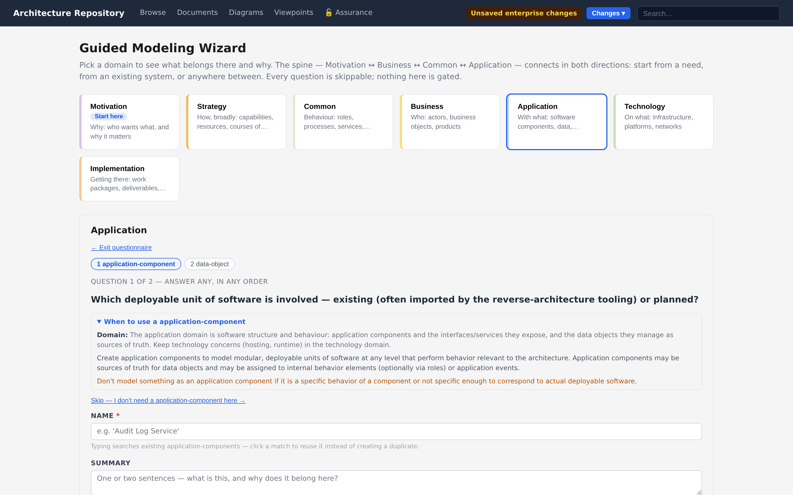

**Honesty checkpoint.** The same model that shows what exists also shows what's missing:
executing the [motivation-coverage](03-modeling/coverage-semantics.md) viewpoint against
this very model reports real, current gaps — goals whose branches do not all terminate
in realized requirements. The self-model is a working model, not a brochure.

<!-- media: docs/media/motivation-coverage-gaps.png — live model fallback with pinned scope and group -->
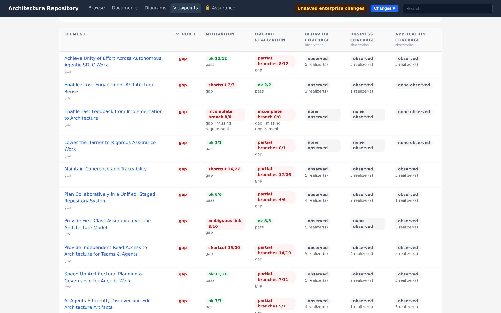

&nbsp;

## Part 2 — The platform analyzing itself

The assurance store's seed content is the platform's own analysis, made with the
platform's own method tooling.

**7. A real hazard analysis of a real fix.** The STPA-Sec analysis
*PlantUML Preprocessor Untrusted-Input Disclosure* (`STPA@1784721732.pflr.3e4395` in the
seeded store) analyzes an actual security finding in the diagram-rendering path — a
preprocessor feature that could read files on user-submitted input — and carries the
constraints that were then shipped as code. Open it in the
[assurance explorer](04-assurance/exploring-assurance.md) and walk hazard →
loss scenario → constraint; the control-structure binding lands on the Architecture
Backend, the same entity you reached in Part 1.

<!-- media: docs/media/assurance-graph-explore.png -->
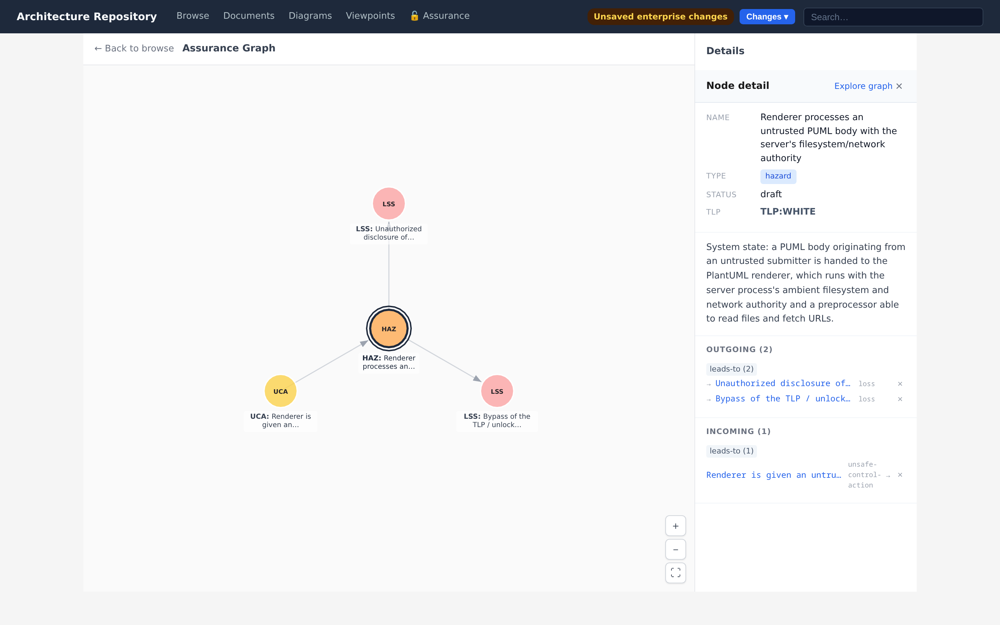

<!-- media: docs/media/assurance-method-workflow.png -->
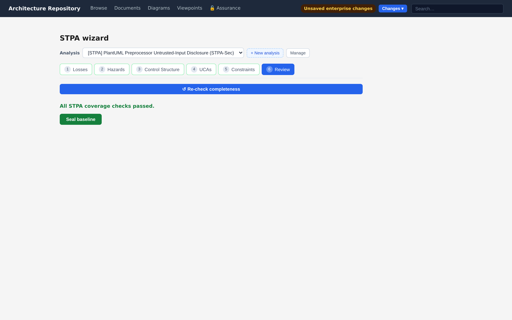

**8. Supply-chain posture on the same entities.** The backend's and the GUI's own SBOMs
are ingested as [security signals](04-assurance/security-signals.md) against their
self-model entities, and the `security-posture` viewpoint renders the result over the
application layer — with the fail-closed locked state and the stamped export path the
capability guarantees.

<!-- media: docs/media/security-posture-viewpoint.png — synthetic documentation findings are visibly marked -->
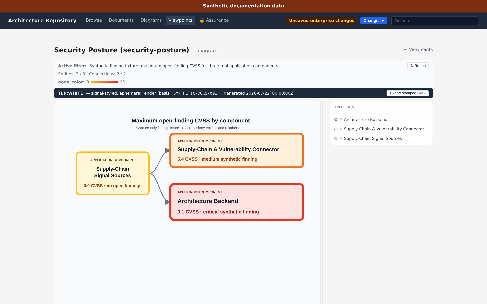

<!-- media: docs/media/security-metrics-locked.png -->
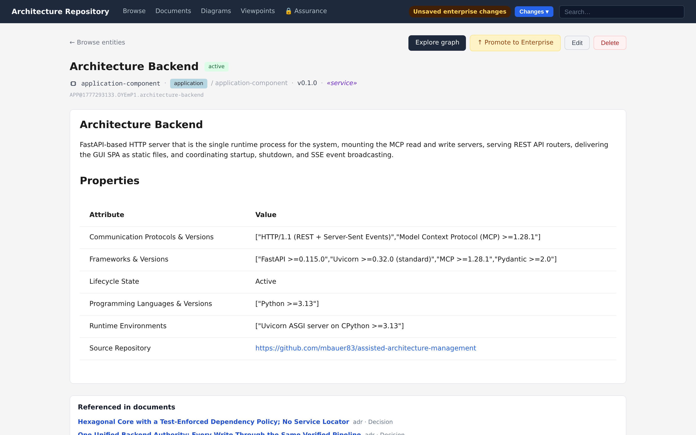

<!-- media: docs/media/security-export-stamped.png — synthetic documentation findings are visibly marked -->
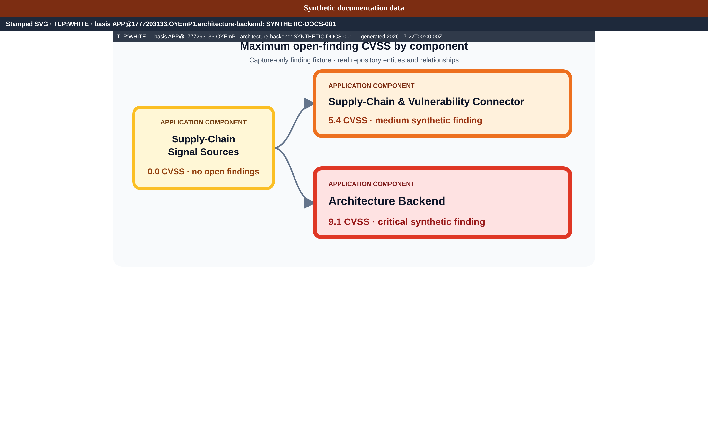

&nbsp;

## Reproduce this walk yourself

```bash
arch-init && arch-backend --daemon          # the bundled workspace IS the self-model
arch-assurance init && arch-assurance seed --with-signals   # optional: the assurance side
```

Then follow the links above — or hand the same walk to an agent: every stop on this
page is reachable through `artifact_query_read_artifact`,
`artifact_query_find_connections_for`, and the `arch-assurance-read` tools.

---

*Try building your own: [Your first model →](07-first-model.md)*
